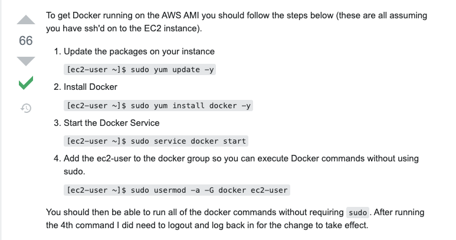

# Running on an AWS ec2 VM

Amazon Web Services offers reliable, scalable, and inexpensive cloud computing services. Free to join, pay only for what you use.

## Initialize

- First you need to set up your AWS account
- If you are currently a student, sign up for [Github Developer Pack](https://education.github.com/pack).
- You will get several awesome offers, including a free AWS student account with $100 credit!
- Once you have an account you will need to go to your console through your aws account
- Next go to [Launch a virtual machine](https://console.aws.amazon.com/ec2/v2/home?region=us-east-1#LaunchInstanceWizard:)
- Choose the Amazon Linux 2 AMI (HVM), SSD Volum Type
  - **This should be the first option available**
- Be sure to download and save your key-pair.pem
  - **Need to protect this private key file with instructions [here](https://stackabuse.com/how-to-fix-warning-unprotected-private-key-file-on-mac-and-linux/)**

## ssh into your vm instance

- I prefer to do this on my local machine
- [here](https://docs.aws.amazon.com/AWSEC2/latest/UserGuide/AccessingInstancesLinux.html) are some steps to connecting via SSH provided by AWS
- TIP: **Your username is likely ec2-user**
  - To check this, go to your EC@ instance and hit connect at the top

## Download Docker

- Awesome instructions [here](https://cloudaffaire.com/how-to-install-git-in-aws-ec2-instance/)
- Git is necessary for cloning your repositories over and running your personal twitter bot on this VM

## Download Redis

- Awesome instructions [here](https://medium.com/@feliperohdee/installing-redis-to-an-aws-ec2-machine-2e2c4c443b68)
- Very easy and can be completed in < 10 minutes
- Be sure to create a secure password if you choose to configure remote access (recommended >= 32 characters)
- Find your external IP on your VM console (needed for the HOST env variable)

## Create custom TCP (IF you want to use Redis outside of your VM)

- Also need to create a custom TCP internal security group
- To do this go to Security then click on the security group listed
- Next Edit Inbound rules
- Should look like this
- 

## Download Docker

- Awesome instructions

* 
* **Check that install worked**

- $ docker --version
- If this shows your docker version then you've successfully installed docker on your vm instance

## Clone your git repository to run within docker

- $ git clone https://github.com/abspen1/twitter-bot.git
- $ ls (check that the repo cloned into your instance)

## Build the docker image

- cd into twitter-bot directory
- $ docker build -t bot .

## Check if image was created

$ docker image ls

## Run docker image in a container

```bash
$ docker run -d \
  --name bot_name \
  --restart unless-stopped \
  -e CONSUMER_KEY="some consumer ID" \
  -e CONSUMER_SECRET="some consumer secret KEY" \
  -e KEY="some key ID" \
  -e SECRET="some secret key ID" \
  -e HOST="external ip address" \
  -e REDIS_PASS="some password" \
  -v $PWD:/work \
  bot
```

## Check that the container is running

- $ docker container ls
- $ docker logs bot_name
